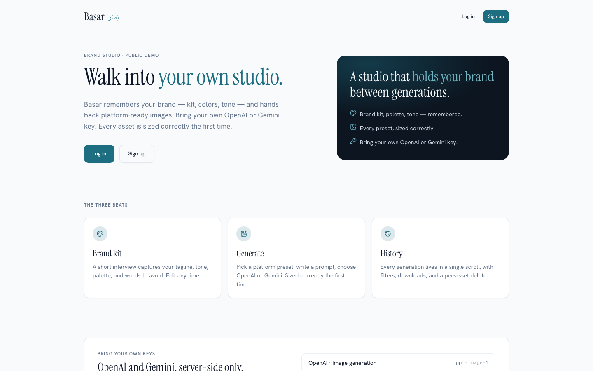
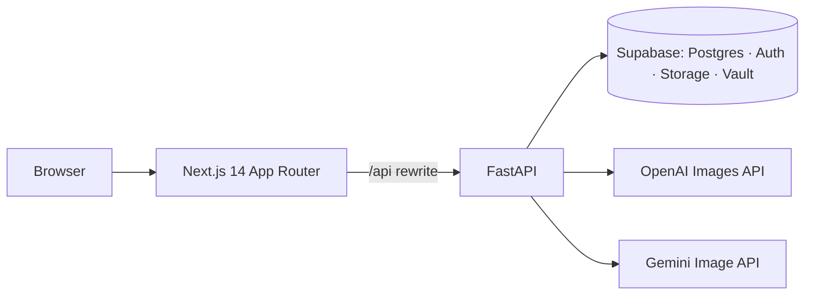

# Basar

A multi-brand social-image studio. Basar remembers each brand's kit, logo, and tone, and turns a one-line prompt into a platform-ready image. Bring your own OpenAI or Gemini keys. Built on Next.js 14, FastAPI, and Supabase.




_Captures: landing, generate canvas, brand kit. Full list: [screenshot checklist](docs/screenshot-checklist.md)._

## Features

- **Brands** — create, rename, and delete brands with a logo upload (PNG / JPEG / WebP, 5 MB cap).
- **Brand kit interview** — tagline, tone, audience, palette, and "words to avoid" captured once and re-used on every prompt.
- **BYOK + Vault** — paste an OpenAI or Gemini key once; the backend stores it encrypted in a Supabase Vault secret and reads it on every generate call. Keys never reach the browser.
- **13 platform presets** — Instagram, Facebook, Twitter, LinkedIn, TikTok, YouTube; each preset ships with its native aspect ratio and exact dimensions.
- **Generation history** — every image is stored, filterable by provider / status / preset, with per-asset download and delete.
- **Operator admin** — read-only dashboard for `ADMIN_EMAILS` with totals, status and provider breakdowns, and a paged brand list.

## Architecture



Browser never talks to Supabase directly with the service-role key; the backend is the only process that holds it. The frontend holds the publishable (anon) key and relies on RLS plus row ownership checks on every read/write.

See [ARCHITECTURE.md](ARCHITECTURE.md) for the route-by-route map and the cookie-vs-Bearer-vs-JWKS split.

## Quick Start (Docker)

Get the app running in 5 steps. You need **Docker**, **Node.js/npm** (for the Supabase CLI in step 4), and a **Supabase project**.

### 1. Clone and enter the repo

```bash
git clone <repo-url> && cd basar
```

### 2. Get your Supabase credentials

From the [Supabase Dashboard](https://supabase.com/dashboard) → your project → **Settings → API**, grab:

| Value | Where to find it |
|-------|-----------------|
| **Project URL** | Settings → API (e.g. `https://xxxxx.supabase.co`) |
| **Publishable key** | Settings → API → Project API keys |
| **Secret key** | Settings → API → Project API keys (reveal) |

### 3. Create your env files

```bash
# Backend
cp backend/.env.example backend/.env

# Frontend
cp frontend/.env.local.example frontend/.env.local
```

Edit **`backend/.env`** — fill in Supabase values:

```bash
SUPABASE_URL=https://xxxxx.supabase.co
SUPABASE_SECRET_KEY=sb_secret_...
```

Edit **`frontend/.env.local`** — fill in URL and publishable key:

```bash
NEXT_PUBLIC_SUPABASE_URL=https://xxxxx.supabase.co
NEXT_PUBLIC_SUPABASE_PUBLISHABLE_KEY=sb_publishable_...
```

### 4. Set up the database

Install the [Supabase CLI](https://supabase.com/docs/guides/cli/getting-started), then log in and push migrations:

```bash
supabase login
supabase link --project-ref <your-project-ref>
supabase db push
```

> **Where is my project ref?** It's in your Supabase Dashboard URL: `supabase.com/dashboard/project/<project-ref>`

Then create the **`brand-assets`** storage bucket in the Dashboard → **Storage → New bucket**:

- **Public bucket**: Yes
- **File size limit**: 5 MB
- **Allowed MIME types**: `image/png, image/jpeg, image/webp`

Finally, configure auth redirects in the Dashboard → **Authentication → URL Configuration**:

- **Site URL**: `http://localhost:3000`
- **Redirect URLs**: add `http://localhost:3000/auth/confirm`

### 5. Build and run

```bash
make up
```

The app is now running at **http://localhost:3001**.

Check health: `make health` | View logs: `make logs`

> **Port**: The app is mapped to host port `3001` by default. Override with `make up APP_PORT=<port>`. If you change the port, also update `CORS_ORIGINS` in `backend/.env` to match.

For production demo builds, set `NEXT_PUBLIC_SIGNUPS_ENABLED=false` in the frontend build environment so `/signup` renders a closed-state card instead of a registration form. See [docs/security.md](docs/security.md) for the full security posture and the rate-limit / JWT / Vault hardening notes.

## Local Development (without Docker)

For active development with hot-reload, run the backend and frontend directly.

### Prerequisites

- Node.js 18+
- Python 3.13+
- [Supabase CLI](https://supabase.com/docs/guides/cli/getting-started)

### Backend

```bash
cd backend
cp .env.example .env   # fill in Supabase credentials (see step 2 above)
python -m venv venv
source venv/bin/activate
pip install -r requirements.txt
uvicorn app.main:app --reload --host 127.0.0.1 --port 8000
```

### Frontend

```bash
cd frontend
cp .env.local.example .env.local   # fill in Supabase credentials (see step 2 above)
npm install
npm run dev
```

## Makefile Commands

| Command | Description |
|---------|-------------|
| `make build` | Build Docker image |
| `make up` | Build and run container |
| `make down` | Stop and remove container |
| `make logs` | Tail container logs |
| `make restart` | Restart container |
| `make shell` | Shell into running container |
| `make health` | Check container health |
| `make clean` | Remove container and image |
| `make dev` | Show local dev instructions |
| `make dev-backend` | Run backend locally |
| `make dev-frontend` | Run frontend locally |
| `make lint` | Lint backend + frontend |
| `make test` | Run backend tests |

See [docs/docker.md](docs/docker.md) for full Docker/deployment details.

## Demo account

The demo build ships a pre-seeded operator account:

- **Email**: `demo@basar.example`
- **Password**: set at publish — never commit it to git.

See [docs/demo-seed.md](docs/demo-seed.md) for the full manual seed procedure (create the auth user in the Dashboard, replace the placeholder UUID in `supabase/seed_demo.sql`, upload the assets to `brand-assets`, run the SQL). The seed inserts zero provider keys; the demo BYOK notice stays visible until a real key is added.

## More reading

- [docs/case-study.md](docs/case-study.md) — the problem, the constraints, the five key decisions, and the generation pipeline.
- [docs/cv-bullets.md](docs/cv-bullets.md) — six resume bullets plus a 3-line LinkedIn blurb.
- [ARCHITECTURE.md](ARCHITECTURE.md) — route-by-route map from FastAPI to UI.
- [specs/](specs/) — feature specifications and contracts that drove the build.

## License

[MIT](LICENSE) — copyright Basar contributors.